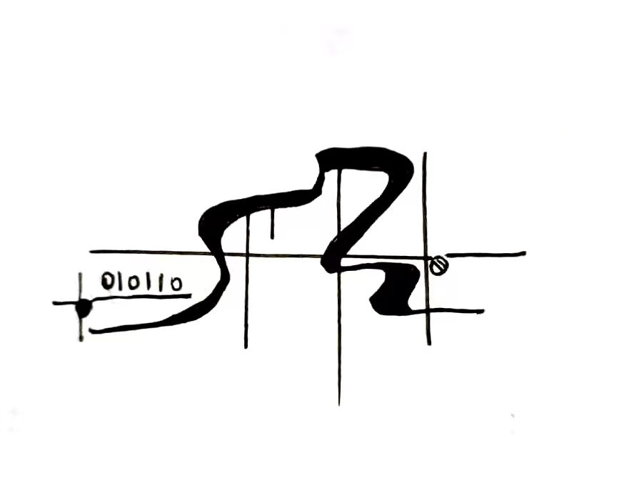

<div align="center">

[](https://github.com/BarrenSea/algori/fork)
[](https://github.com/BarrenSea/algori)
[](https://github.com/BarrenSea/algori)
[](https://github.com/BarrenSea/algori)
[](https://conventionalcommits.org)


</div>

<p align="center">
  <a href="https://github.com/barrensea/rddns" rel="noopener">
 </a>

 <h3 align="center"><a href="https://github.com/barrensea/rddns">Rddns</a></h3>
  <p align="center">
    Rust DDNS For NSD
    <br />
    <br />
    <a href="https://matrix.to/#/#algori:mozilla.org">Matrix</a>
  </p>
</p>

# RDDNS
## Use
### Server
``` shell
	git clone https://github.com/barrensea/rddns && cd rddns
	cargo build --release
	./target/release/rddns --nds /etc/nsd/zone/example.zone
```

### Client
You Can Use *Curl* with the server
#### DDNS
``` shell
	curl -X POST http://your-nsd-server-domain/ddns/your-domain-want-to-change/new-address
```


##### Example
``` shell
	curl -XPOST http://123.com/ddns/www.123.com./123.123.123.123
	curl -XPOST http://123.com/ddns/www/123.123.123.123
	curl -XPOST http://123.com/ddns/www/$(curl -XGET http://123.com/ip)
```

#### Get your ip
``` shell
	curl -XGET http://your-nsd-server-domain/ddns/your-domain-want-to-change/new-address
```

##### Example
``` shell
	curl http://123.com/ip
```


## Help
```
DDNS Server and Client for Nsd

Usage: rddns [OPTIONS] --nsd <nsd>

Options:
  -a, --address <ADDRESS>  [default: 0.0.0.0:3000]
  -n, --nsd <nsd>
  -w, --workers <WORKERS>  [default: 1]
  -h, --help               Print help
  -V, --version            Print version
```
